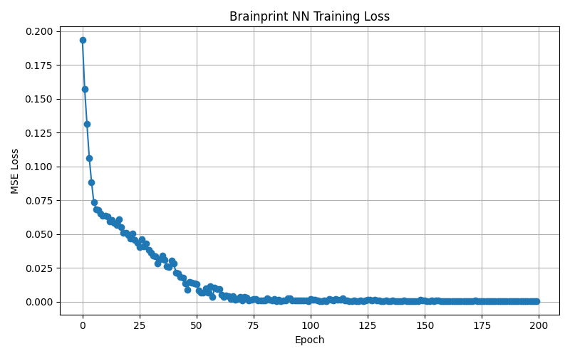
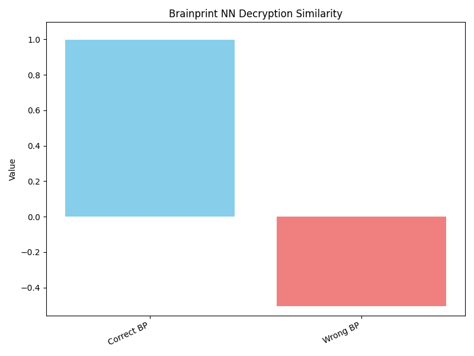
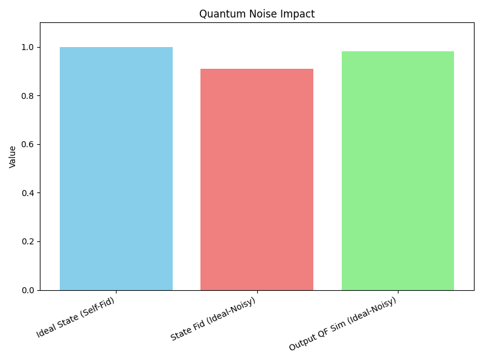
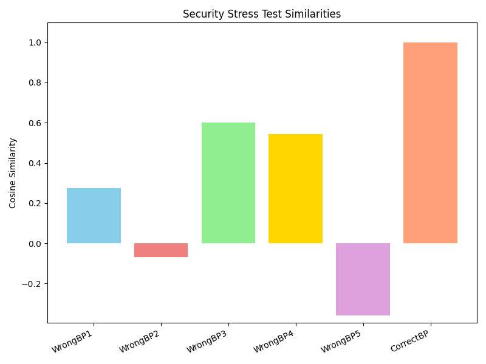

# Quantum-Neuro AI Sovereign 2.0 Demo

## Overview

**Quantum-Neuro AI Sovereign 2.0** is a conceptual simulation that showcases a futuristic architecture combining quantum computing, neural networks, simulated post-quantum cryptography, blockchain fundamentals, and explainable artificial intelligence (XAI). The system is designed to explore secure and personalized thought processing using quantum feature encoding, encrypted AI-based decryption, and privacy-preserving authentication mechanisms. It serves as a prototype for advanced AI-human interaction in a post-quantum world.

## Features

- **Quantum-Enhanced Thought Encoding and Encryption**  
  Encodes TF-IDF text embeddings into quantum states and encrypts them using simulated lattice-based (LWE-like) cryptography.

- **Personalized AI Thought Decryptor ("Brainprint")**  
  A PyTorch neural network that decrypts quantum-encoded thoughts only when supplied with a matching brainprint key.

- **Zero-Knowledge-Like Proof of Mind Matching**  
  Implements a Schnorr-inspired interactive proof system to validate knowledge of a secret brainprint without revealing it.

- **Quantum Noise-Resilience Simulation**  
  Simulates the impact of depolarizing and amplitude damping noise on quantum states and evaluates fidelity and feature similarity.

- **Adaptive Quantum Circuit Architecture Optimization**  
  Dynamically selects optimal PQC depth based on output variance to improve encoding efficiency.

- **Multi-Modal Thought Fusion**  
  Combines simple text and image features into a unified quantum representation and demonstrates successful joint decryption.

- **Explainability Module**  
  Logs step-by-step human-readable reasoning behind the AI pipeline's decision-making.

- **Blockchain-Based Thought Ledger**  
  Lightweight blockchain implementation for timestamped, hashed, and verifiable logging of encrypted thoughts.

- **Performance Metrics & Visualization**  
  Tracks training loss, decryption accuracy, noise impact, and more; generates visualizations.

- **Security Stress Test**  
  Evaluates system robustness against brute-force decryption attempts using incorrect brainprints.

## Key Results & Insights

- **Text Fidelity:** End-to-end pipeline reconstruction similarity reached **0.9685** post encryption and decryption.
- **Brainprint AI Decryptor:**
  - Final loss: **0.0001**
  - Correct BP cosine similarity: **0.9974**
  - Wrong BP cosine similarities: e.g., **-0.5069**
- **Zero-Knowledge Proof:** Verification result: **1.0000**
- **Noise Resilience:**
  - Fidelity under noise: **0.9086**
  - Quantum feature similarity (ideal vs noisy): **0.9819**
- **Multi-Modal Decryption:** Similarity: **0.9978**
- **Security Test:** 0 successful decryptions from 5 wrong brainprints (threshold: 0.80)

## Setup

### Requirements

- **Python Version:** 3.8+

### Installation

Create and activate a virtual environment:

```bash
python3 -m venv qnai_env
source qnai_env/bin/activate  # On Windows use: qnai_env\Scripts\activate
````

Install required dependencies:

```bash
pip install numpy scikit-learn pennylane torch matplotlib
```

## Running the Demo

Run the script:

```bash
python qnai_sovereign_demo.py
```

**Outputs:**

* Logs detailing each module's progress and results (console)
* Explainability report: `explainability_report.txt`
* Visualization plots (in `plots/`)
* Proposal summary: `QuantumNeuroAISovereign_Proposal.md`

## Generated Outputs

* `explainability_report.txt`: Step-by-step reasoning logs.
* `QuantumNeuroAISovereign_Proposal.md`: Summary of system design and output.
* `plots/`:

  * `brainprint_nn_training_loss_nn_loss.png`
  * `brainprint_nn_decryption_similarity.png`
  * `quantum_noise_impact.png`
  * `security_stress_test_similarities.png`

## Visualizations

### Brainprint NN Training Loss



### Brainprint NN Decryption Similarity



### Quantum Noise Impact



### Security Stress Test Similarities



## Code Structure

The project is implemented as a **single Python script** (`qnai_sovereign_demo.py`). Modules are internally organized and configurable at the top of the script.

## Notes & Limitations

* This project is a **conceptual demo** intended for academic and exploratory purposes.
* PQC and blockchain mechanisms are **simulated** and do not represent production-ready implementations.
* Quantum circuits run on classical **simulators** using PennyLane.
* The neural network performance reflects illustrative behavior under constrained conditions.
